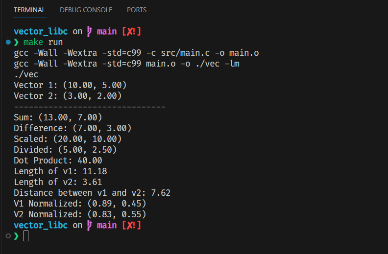

# 2D Vector Lib (vector_libc)

While learning more about vectors and their operations, I wanted to see it in action so I created a very rudimentary library for 2 dimensional vectors.

With the respective arithmetic being:
* Addition  
* Subtraction
* Division
* Multiplication

And functions for:
* The dot product
* The magnitude
* Distance between two vectors

To run the project (you need gcc, otherwise you need to update the makefile to use your compiler and flags etc):

```
make && ./vec

or

make run
```



Clean up can be done with ```make clean```
